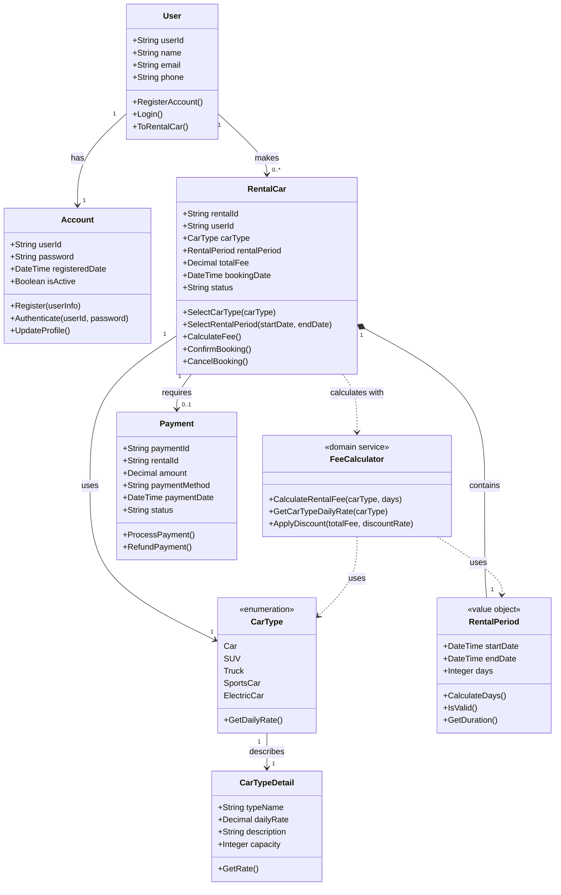

# CD_01 車輛租用系統 - Class Diagram

## 領域模型類別圖

## 類別說明

### User (用戶)
- **職責**: 代表租車系統的用戶
- **屬性**: 
  - userId: 用戶唯一識別碼
  - name: 用戶姓名
  - email: 電子郵件
  - phone: 聯絡電話
- **方法**: 註冊、登入、租車操作

### Account (帳號)
- **職責**: 管理用戶帳號與認證
- **屬性**: 
  - userId: 帳號 ID
  - password: 加密密碼
  - registeredDate: 註冊日期
  - isActive: 帳號狀態
- **方法**: 註冊、認證、更新資料

### RentalCar (租車預約)
- **職責**: 核心聚合根 (Aggregate Root)，管理租車預約
- **屬性**:
  - rentalId: 租車單號
  - userId: 租車用戶
  - carType: 車型
  - rentalPeriod: 租用期間
  - totalFee: 總租金
  - status: 預約狀態
- **方法**: 選擇車型、設定租期、計算費用、確認/取消預約

### CarType (車型列舉)
- **職責**: 定義可選車型
- **車型清單**:
  - Car (轎車): 1,000 元/天
  - SUV (休旅車): 1,500 元/天
  - Truck (貨車): 2,000 元/天
  - SportsCar (跑車): 3,000 元/天
  - ElectricCar (電動車): 2,800 元/天

### CarTypeDetail (車型詳細資訊)
- **職責**: 儲存車型的詳細資訊與定價
- **屬性**:
  - typeName: 車型名稱
  - dailyRate: 日租金
  - description: 車型描述
  - capacity: 乘載人數

### RentalPeriod (租用期間)
- **職責**: Value Object，封裝租用時間邏輯
- **屬性**:
  - startDate: 起租日期
  - endDate: 還車日期
  - days: 租用天數
- **方法**: 計算天數、驗證日期有效性

### FeeCalculator (費用計算器)
- **職責**: Domain Service，處理租金計算邏輯
- **方法**:
  - CalculateRentalFee: 計算總租金 (車型日租金 × 租用天數)
  - GetCarTypeDailyRate: 取得車型日租金
  - ApplyDiscount: 套用折扣

### Payment (付款)
- **職責**: 管理付款交易
- **屬性**:
  - paymentId: 付款單號
  - rentalId: 關聯租車單
  - amount: 金額
  - paymentMethod: 付款方式
  - status: 付款狀態
- **方法**: 處理付款、退款

## 關聯說明

1. **User - Account**: 1:1 關係，每個用戶擁有一個帳號
2. **User - RentalCar**: 1:N 關係，一個用戶可以有多筆租車記錄
3. **RentalCar - CarType**: M:1 關係，每筆租車選擇一種車型
4. **RentalCar - RentalPeriod**: 1:1 組合關係，租車單包含租用期間
5. **RentalCar - Payment**: 1:0..1 關係，租車可能需要付款
6. **FeeCalculator**: 依賴 CarType 和 RentalPeriod 進行計算
7. **CarType - CarTypeDetail**: 1:1 關係，描述車型詳細資訊

## 設計原則

- **Aggregate Root**: RentalCar 作為聚合根，控制預約的完整生命週期
- **Value Object**: RentalPeriod 作為值物件，封裝租用時間的業務規則
- **Domain Service**: FeeCalculator 處理跨實體的計算邏輯
- **Enumeration**: CarType 使用列舉定義固定的車型選項
