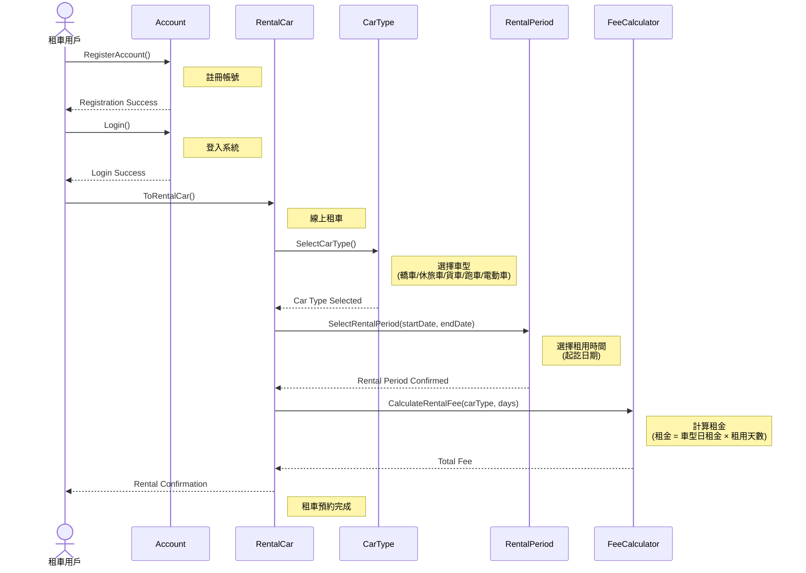

# SD_01 車輛租用系統 - Sequence Diagram

## 線上租車流程

## 流程說明

### 1. 註冊帳號 (RegisterAccount)
- 租車用戶向 Account 領域物件註冊帳號
- 建立用戶個人資料

### 2. 登入 (Login)
- 用戶使用 UserID 登入系統
- 通過身份驗證後才能進行租車

### 3. 線上租車 (ToRentalCar)
包含以下步驟：

#### 3.1 選擇車型 (SelectCarType)
- 可選車型：
  - 轎車 (Car): 1000 元/天
  - 休旅車 (SUV): 1500 元/天
  - 貨車 (Truck): 2000 元/天
  - 跑車 (SportsCar): 3000 元/天
  - 電動車 (ElectricCar): 2800 元/天

#### 3.2 選擇租用時間 (SelectRentalPeriod)
- 指定租車起訖日期
- 系統計算租用天數

#### 3.3 計算租金 (CalculateRentalFee)
- 根據車型與租用天數計算總租金
- 計算公式：租金 = 車型日租金 × 租用天數

### 4. 租車確認
- 系統回傳租車預約完成訊息
