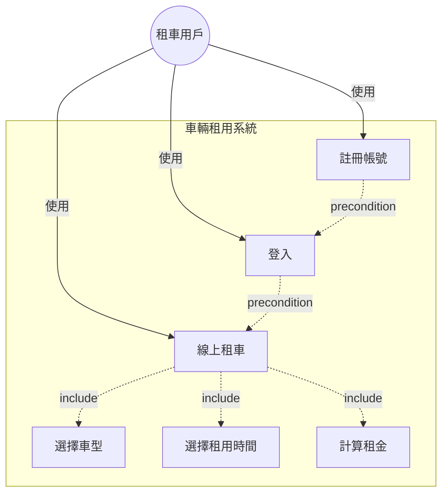

# UC_01 車輛租用系統

## Use Case Diagram

## Use Case 說明

### UC1: 註冊帳號
- **Actor**: 租車用戶
- **描述**: 租車用戶註冊個人帳戶資料
- **前置條件**: 無
- **後置條件**: 帳戶建立成功，可進行登入

### UC2: 登入
- **Actor**: 租車用戶
- **描述**: 已註冊用戶使用 UserID 登入系統
- **前置條件**: 已完成註冊帳號
- **後置條件**: 用戶通過身份驗證，可使用系統功能

### UC3: 線上租車
- **Actor**: 租車用戶
- **描述**: 用戶在線上預約租用車輛
- **前置條件**: 用戶已登入系統
- **包含用例**: 
  - UC4: 選擇車型
  - UC5: 選擇租用時間
  - UC6: 計算租金
- **主要流程**:
  1. 選擇車型（轎車、休旅車、貨車、跑車、電動車）
  2. 選擇租用時間區間
  3. 系統計算租金
  4. 確認租用

### UC4: 選擇車型
- **描述**: 用戶選擇欲租用的車型
- **可選車型**:
  - 轎車 (Car): 1000 元/天
  - 休旅車 (SUV): 1500 元/天
  - 貨車 (Truck): 2000 元/天
  - 跑車 (SportsCar): 3000 元/天
  - 電動車 (ElectricCar): 2800 元/天

### UC5: 選擇租用時間
- **描述**: 用戶指定租車起訖日期
- **輸入**: 開始日期、結束日期

### UC6: 計算租金
- **描述**: 系統根據車型與租用天數計算總租金
- **計算公式**: 租金 = 車型日租金 × 租用天數
